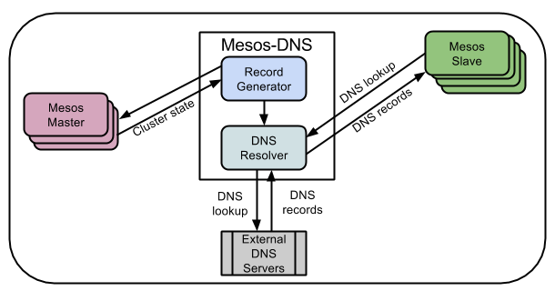

.. MIP App Framework documentation master file, created by
   sphinx-quickstart on Tue Feb  7 00:24:36 2017.
   You can adapt this file completely to your liking, but it should at least
   contain the root `toctree` directive.

Welcome to Maracker's documentation!
=============================================

.. .. toctree::
   :maxdepth: 2
   :caption: Contents:

Introduction
============

Ce document décrit la réalisation d'une API facilitant le déploiement
d'applications dans une infrastructure de type SaaS (Software as a Service)
dans le cadre d'un travail de bachelor en collaboration avec le CHUV et
la HE-ARC.

Le CHUV participe au projet Human Brain Project qui a pour but de mettre en
place une infrastructure de recherche pour différents domaines liés à
l’étude du cerveau (neurosciences mais pas uniquement).
Ce projet est décomposé en 12 sous-projets. L’équipe de développement du CHUV
s’occupe de la réalisation du sous-projet 8 (SBP8):
Medical Informatics Platform (MIP).

Le premier but du SP8 est de proposer divers outils permettant de mieux
comprendre les différences et similitudes entre différentes maladies
du cerveau. Ces outils permettraient de mieux classifier, diagnostiquer
et traiter ces maladies en se basant sur une grande quantité de données
médicales anonymisées.

Son deuxième but est de rendre ces outils accessibles au-travers
d’une plateforme web. Quelques applications ont déjà été développées et
intégrées à la plateforme. Cependant il n’existe pas de moyen simple de
déployer une application tierce provenant des communautés de chercheurs en
neuroscience ou statistiques dans l’infrastructure existante et de pouvoir
la gérer (démarrage, arrêt, exposition) aujourd’hui.

La plateforme MIP contient déjà une infrastructure permettant de gérer
des services encapsulés dans des containers Docker et répartis dans un cluster
de machines avec les techonologies de Mesosphere (Mesos et Marathon).

.. raw:: latex

   \clearpage

Buts du projet
--------------

.. figure:: images/170530-schema_simplifie.png
   :align: center
   :alt: Schéma d'architecture simplifé

   Schéma d'architecture simplifié

Marathon propose une API REST permettant d'instancier des applications et
d'en gérer le nombre d'instances. Le but du travail consiste à réaliser
une API permettant de déployer des applications (web services) packagées
dans des containers Docker. Cette API serait une surcouche à celle de Marathon.
Pour qu'une application soit déployable, il faudrait que les métadonnée
contenues dans le Dockerfile de celle-ci décrivent les ressources
(CPU et mémoire) dont elle a besoin.

Si cette partie est réalisée, le développeur pourra rerchercher et mettre
en oeuvre une solution permettant d'exposer les applications instanciées
dans Marathon. Des solutions open source existantes comme *traefik* et *vamp*
peuvent constituer de bonnes pistes pour régler cette problématique.

S'il reste du temps, le développeur pourra développer une petite application
proposant à l'utilisateur une liste d'applications en disponibles et
en exécution. Il pourra ensuite les tester grâces à des `<iframe>`.

On peut donc résumer les objectifs de la manière suivante:

1. Mettre en place une base de données PostgreSQL répertoriant différentes
   applications disponibles et déployables dans l’infrastructure.
   Cette base de données contiendrait plusieurs informations;
   nom de l’image Docker, nom de l’application, description de l’application
   et des informations de déploiement (mémoire, CPU nécessaires)
   contenus.
2. Développer une API REST permettant de faire du CRUD sur la base
   de données (ajout/suppression/modification). L’API permettrait
   également de demander le démarrage/arrêt d’une application
   particulière à l’aide de l’API de Marathon.
3. Tester voire mettre en œuvre une solution permettant d’exposer
   les applications déployées avec Marathon aux utilisateurs.
4. Réaliser un démonstrateur permettant de tester l’API et éventuellement
   afficher les applications déployables de manière similaire au Dockstore.
   Les applications en cours d’exécution pourraient être affichées à
   l’aide d’`<iframe>`.

Les objectifs *1* et *2* sont considérés comme objectifs primaires et
constituent le coeur du travail. Les objectifs *3* et *4* sont
des objectifs secondaires.

Voici un schéma illustrant les différents composant à développer ou mettre
en place lors du projet:

Outils et technologies utilisées
--------------------------------

Cette partie décrit les différentes technologies et outils utilisés pour la
réalisation du projet. Elle mélange de nombreux outils permettant de gérer
des machines virtuelles, gérer des containers ou encore de mettre en
communication plusieurs containers. L'ensemble des logiciels présentés sont
open-source.

Vagrant
~~~~~~~

Vagrant est un outil open source permettant de créer et gérer des machines
virtuelles. Il fonctionne avec un fichier `Vagrantfile` décrivrant
les propriétés de la machine virtuelle telles que la distribution utilisée
son nom et sa configuration réseau par exemple. Notez que ce fichier est
écrit en Ruby.

On peut créer un `Vagrantfile` facilement grâce à la commande
:code:`vagrant init centos/7` qui crée un `Vagrantfile` basé sur une machine
CentOS par exemple. On peut ensuite lancer la machine virtuelle en se plaçant
dans le dossier contenant le `Vagrantfile` et en utilisant la commande
:code:`vagrant up`. On peut ensuite se connecter à la machine virtuelle en ssh
grâce à la commande :code:`vagrant ssh`. On peut éteindre la machine virtuelle
démarrée avec la commande `vagrant halt` ou `vagrant destroy` si on désire
effacer complètement la machine virtuelle.

Vagrant a besoin d'une solution de virtualisation pour fonctionner. Il supporte
**Virtualbox**, **Docker** et également **KVM**/**libvirt** qui remplissent
ce rôle.
Il est généralement utilisé avec Virtualbox mais il semble que KVM soit
la solution à privilégier. Utilisé par DigitalOcean et Linode, KVM est un bon
compromis entre performance et sécurité.

Mesos
~~~~~

Développé à l'université de Berkley, **Mesos** permet de gérer des clusters de
machines.
Ce logiciel propose plusieurs outils permettant l'isolation de CPU, de
mémoire et de fichiers. Utiliser un tel logiciel permet donc de partager
les ressources d'une infrastructure. En général, Mesos est utilisé
conjointement avec **Marathon**. Mesos est utilisé pour la gestion de systèmes
distribués de grandes entreprises telles que Twitter, Airbnb, Apple ou
encore Verizon.

Mesos supporte Docker et permet une isolation entre les tâches et les containers
devant les réaliser.
Concernant son utilisation, Mesos propose un CLI et une interface web permettant
son administration.

Deux types d'instances de Mesos fonctionnent conjointement; une instance master
et une instance slave. Pour qu'une application travaille avec Mesos, il est
nécessaire d'utiliser un framerwork. Celui-ci est composé d'un scheduler
(responsable de traiter les offres de ressources) et un executor utilsable par
l'esclave pour réaliser une ou plusieurs tâches du framework. Il existe
des framework dans différents langages; Chronos ou Spark pour Scala, Hadoop ou
Storm pour Java et dpark pour Python.

L'interaction antre le framework, le master et le slave se fait de la manière
suivante:

1. Le slave notifie le master des ressources (nombre de CPUs, mémoire, etc.)
   dont il dispose.
2. Le master transmet l'offre de ressource du slave au framework.
3. Le scheduler du framework répond au master en lui transmettant des tâches
   à réaliser par le slave à disposition.
4. Le master transmet les tâches au slave qui exécute les tâches du framework
   en utilisant les excutors de ce dernier. Si les tâches du framework
   n'utilisent pas toutes les ressources du slave, celui-ci peut proposer
   le reste des ressources disponibles à un autre framework.
5. Lorsqu'un tâche est terminée, le slave recommence le cycle à l'étape 1.

ZooKeeper permet d'élire un master si le démarrage de ce dernier échoue.

Sources:

- `Présentation de Mesos
  <https://www.slideshare.net/GladsonManuel/mesos-a-simple>`_

Mesos DNS
~~~~~~~~~

**Mesos DNS** est une outil permettant la découverte de services groupés dans
des clusters Apache Mesos. Il fonctionne de manière assez similaire à
un serveur DNS selon le schéma suivant:

Les applications démarrées avec Marathon se font attribuer un nom de domaine
ressemblant à *xxxx*.example.com où *xxxx* est le nom de l'application.

Mesos DNS s'occupe de faire le lien entre lee noms des services et
les adresses IP et ports des machines qui les hebèrgent.

Mesos DNS est configurable au-travers d'un fichier `config.json`.
En voici un fichier d'exemple:

.. code-block:: json

    {
      "zk": "zk://192.168.33.10:2181/mesos",
      "masters": ["192.168.33.10:5050"],
      "refreshSeconds": 60,
      "ttl": 60,
      "domain": "mesos",
      "ns": "ns1",
      "port": 53,
      "resolvers": ["8.8.8.8"],
      "timeout": 5,
      "listener": "0.0.0.0",
      "SOAMname": "root.ns1.mesos",
      "SOARname": "ns1.mesos",
      "SOARefresh": 60,
      "SOARetry":   600,
      "SOAExpire":  86400,
      "SOAMinttl": 60,
      "dnson": true,
      "httpon": true,
      "httpport": 8123,
      "externalon": true,
      "recurseon": true
    }

Sources

- `Brève explication du fonctionnement de Mesos DNS
  <http://mesosphere.github.io/mesos-dns/>`_

Marathon
~~~~~~~~

**Marathon** est un outils de PaaS (Platform as a service).
C'est une surcouche visant à faciliter l'utilisation de Mesos. Il permet de
l'orchestration de containers et faire du scaling (gestion des ressources
et démarrage/arrêt d'applications) pour différents services contenus dans
des containers. Marathon propose une interface web d'administration et
une *API REST* implémentée en *Scala*.

C'est cette API qui sera utilisée pour la réalisation de ce projet.
Pour créer instancier un serveur HTTP en Python, il suffit d'envoyer le fichier
*json* suivant à l'API:

.. literalinclude:: examples/test.json
   :language: json

Toute application instanciée doit avoir un identifiant unique défini par
l'utilisateur (ici `test`). Si l'application se lance au-travers
d'une commande, il faut spécifier celle-ci avec la clé `cmd`.
Si la commande prend des ports en arguments pour rendre l'application
accessible, il est possible d'utiliser les variables `$PORT0`, `$PORT1`, etc.
pour déléguer le choix du port à Marathon. Un port libre sera choisi
alétoirement.
On peut ensuite définir les ressources dont l'application à déployer a
besoin(clés `cpus` et `mem`). Le minimum pour la clé `cpus` est 0.1 et
le minimum pour la clé `mem` est 32. La mémoire est quantifié en Mb.
Les ressources spécifiées sont la quantité de ressources par instance.
Il faut également spéficier le nombre d'instances à l'aide de la clé
`instances`. Si l'on veut modifier une application déjà déployée,
il suffit de faire une requête `PUT` sur l'API avec les champs modifiés
(exemple: le nombre d'instances). Marathon opèrera les modifications
en redéployant l'application.

.. raw:: latex

   \clearpage

Il est également possible d'instancier des containers Docker avec Marathon.
En voici un exemple:

.. literalinclude:: examples/outyet.json
   :language: json

ZooKeeper
~~~~~~~~~

*ZooKeeper* permet de syncronizer différents services entre eux grâce à
un système de stockage clé-valeur implémenté
sous forme d'un système de fichiers. Les clients peuvent lire ou écrire
dans ce système de fichier pour se transmettre des informations et ainsi
partager leurs configurations (accès aux serveurs de base de données, accès
aux serveurs HTTP, etc.). ZooKeeper est utilisé par des entreprises comme
Yahoo! et Reddit.

Avant de démarrer, le serveur ZooKeeper doit être initialisé avec un ID.
Pour par exemple l'initialiser avec un l'ID *1*, il suffit de lancer la
commande `sudo -u zookeeper zookeeper-server-initialize --myid=1`.
Une fois initialisé, le serveur peut être démarré. Comme il se comporte
comme un service sur UNIX, il suffit de lancer la commande
`sudo service zookeeper-server start`. On peut l'appeler avec `enable`
si l'on veut que le serveur démarre au boot de la machine et ainsi éviter
de devoir le démarrer manuellement. On peut le stopper avec `start`.

On peut interagir avec ZooKeeper au-travers de son client à l'aide de
la commande `zookeeper-client`.

ZooKeeper est nécessaire au fonctionnement de la stack Mesos car il permet
la syncronisation entre les noeuds maîtres et les noeuds esclaves.

Chronos
~~~~~~~

*Chronos* est l'équivalent du cron de Linux pour la stack Mesos. Il peut être
utilisé pour plannifier des tâches au-travers de clusters Mesos et gérer des
dépendances entre eux de manière plus ou moins intelligente.

Une utilisation possible de Chronos pourrait consister à redémarrer
des services de manière quotidienne afin de relancer ceux qui seraient
éventuellement bloqué. On pourrait aussi imaginer récupérer des logs et
des dumps de base de données et les transférer sur une autre machine
pour faire des backups.

.. raw:: latex

    \clearpage

Ansible
~~~~~~~

**Ansible** est outils de déploiement automatisé et de provisioning.
Lors du déploiement une machine maître est responsable de
l'orchestration du déploiement et commande machines où doivent être
déployés les services.

Ansible s'utilise généralement avec **Ansible Playbook** qui permet d'exécuter
Ansible et de mettre en place des services grâce à des scripts appelés
*playbooks*. Voici un exemple de playbook permettant de mettre en place
un noeud slave pour un cluster mesos:

.. literalinclude:: examples/playbook.yml
   :language: yaml

Dans chaque playbook, il est nécessaire de définir la machine sur laquelle
on désire déployer nos services (ici `nodes`) ainsi que l'utilisateur qui
s'y connecte (`vagrant` comme il s'agit d'une machine Vagrant). Si certaines
commandes doivent être lancées en tant que super utilisateur, il faut activer
cette fonctionnalité et définir quelle commande permet de changer
d'utilisateur. Dans notre cas, on utilise la commande `sudo`.
Une fois ces quatres variables définies, on peut définir les tâches à réaliser.
Celles-ci seront exécutées l'une après l'autre. Chaque `task` a un nom
décrivant son but et une action. Il existe différents type d'actions:

- `template`: permet de copier des fichiers de la machine hôte à la machine
  distante. Cette commande utilise le moteur de template `jinja <http://jinja.pocoo.org/>`_ et il est possible de lui passer des variables. Cela permet de personnaliser des fichiers de configurations par exemple.
- `apt`, `yum`, ... : permet d'installer des packages facilement. Il existe
  des actions adaptées pour beaucoup de distributions Linux et langages comme
  *ruby* (`bundler`) et *python* (`pip`).
- `shell`: permet de lancer une commande dans le shell.

Ansible est donc un outils de déploiement puissant. Il l'est encore plus
lorsqu'il est combiné avec Vagrant car il permet de recréer un cluster
de machines en quelques minutes.

.. DC/OS
.. ~~~~~

.. Aussi connu sous le nom de *Datacenter Operating System*, *DC/OS* est
.. un système open source prévu pour les systèmes distribués. Ce projet fait
.. partie du projet *Mesosphere*.

.. DC/OS propose les fonctionnalités suivantes:

.. - Partage de ressources
.. - Partage de données
.. - Abstraction programmatique
.. - Monitoring et debugging

.. DC/OS regoupe les composants du système en deux groupes; espace utilisateur
.. et espace noyau. La noeud maître de Mesos et ses agents sont exécutés dans
.. l'espace kernel. Admin Router, Cosmos, Exhibitor, Marathon et Mesos-DNS
.. sont exécutés dans l'espace utilisateur.
.. Admin Router est un répartisseur de charge (load balanceur).
.. Cosmos est une API utilisée pour la gestion des services de DC/OS.
.. Exhibitor est un superviseur pour ZooKeeper.

Gestion de projet
=================

Planification
-------------

Définition et gestion des risques
---------------------------------

Conception
==========

Implémentation
==============

Difficultés
-----------

- Première phase de communication avec le mandant
  - Malentendu au début du projet
  - Difficultés techniques, technologies à prendre en main
  - Temps à disposition du mandant qui est surchargé
  - Résolution: un cahier des charges a finalement pu être défini
- Nombreuses technologies à prendre en main pour comprendre la problématique

Atteintes des objectifs
-----------------------

- Le contexte du mandant a-t-il été compris?
- L'API se superposant à Marathon fonctionne-t-elle?
- Un démonstrateur a-t-il été développé?

.. Indices and tables
.. ==================

.. * :ref:`genindex`
.. * :ref:`modindex`
.. * :ref:`search`
