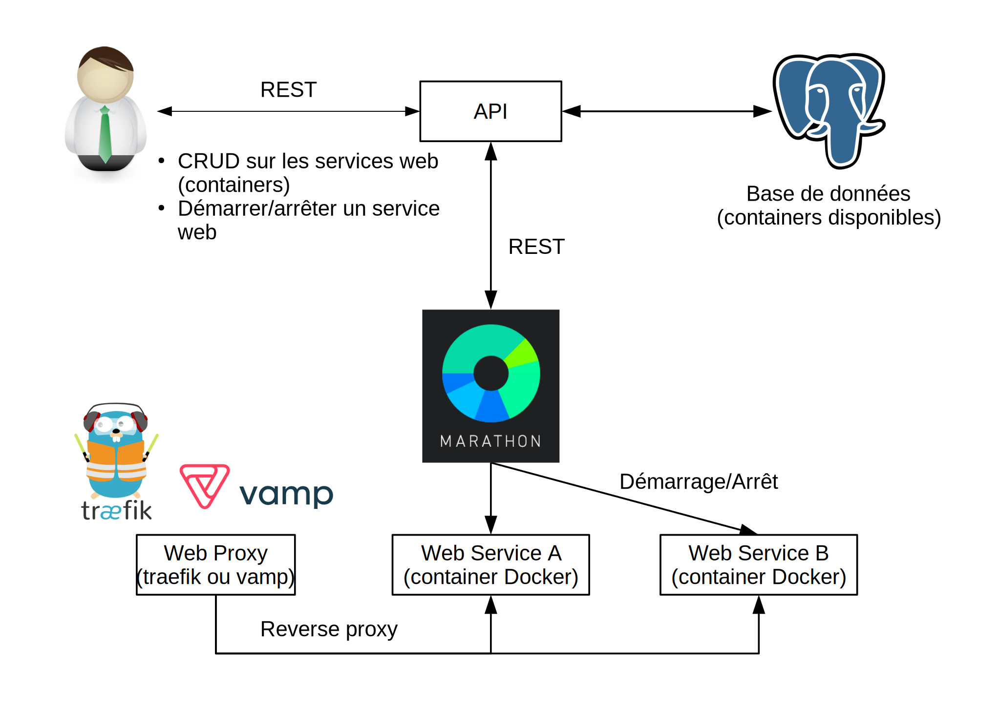

## Sommaire

* Introduction
* Objectifs
* Conception
* Méthodologie
* Problèmes rencontrés
* Analyse critique
* Résultats obtenus
* Questions
* Démonstration

---

## Contexte

---

## [Human Brain Project (HBP)](https://www.humanbrainproject.eu/en/)

* Projet européen ayant pour but de mieux comprendre le fonctionnement du
  cerveau humain.
* Le HBP est décomposé en 12 sous-projets.
* Le CHUV s'occupe du sous-projet 8 (SP8).
    * Mettre en place une [plateforme](https://www.humanbrainproject.eu/en/medicine/medical-informatics-platform/)
      proposant des outils pour les chercheurs.

---

## Cluster

{ width=700px }

<aside class="notes">
  test
</aside>

---

## Objectifs primaires

Mettre en place une API servant de registre d'applications de visualisation
comportant:

* Une base de données [PostgreSQL](https://www.postgresql.org/).
* Différentes routes permettant l'exécution d'opérations CRUD
  sur les applications et leurs configurations.

---

## Objectifs secondaires

* Mettre en œuvre une solution permettant d'exposer
  les applications déployées. (reverse-proxying)
* Réaliser une interface graphique (frontend)
    * utilisant l'API.
    * permettant d'accéder aux applications déployées.

---

## Conception

---

## Frameworks utilisables pour le backend

* Python: [Flask](http://flask.pocoo.org/),
  [Django](https://www.djangoproject.com/)
  <i class="material-icons success">done</i>
* Java: [Spring](https://spring.io/)
* Scala: [Play 2](https://playframework.com/)
* PHP: [Laravel](https://laravel.com/)

---

## Django

* Framework web MVT (Model - View - Template)
* Comporte de nombreux modules dont
  [Django REST framework](http://www.django-rest-framework.org/)
* Grande flexibilité

<aside class="notes">
  - Modules pour communiquer avec Marathon
  - Flexibilité
</aside>

---

## Solutions de reverse-proxying

* [Træfik](https://traefik.io/) <i class="material-icons success">done</i>
* [Vamp](http://vamp.io/)

<aside class="notes">
  - Træfik: exposition des applications uniquement.
  - Vamp: solution plus complète; load-balancing conditionnel,
    autoscaling, etc.
</aside>

---

## Architecture générale

{ width=700px }

---

## Base de données

{ width=700px }

---

## Méthodologie

De manière itérative:

1. Prise en main des différentes technologies/composants de l'infrastructure
  (Mesos, Marathon, Chronos, Docker).
2. Mise en place d'un cluster.
3. Développemment de l'API et sa base de données.
4. Intégration de Træfik dans l'infrastructure mise en place.

---

## Problèmes rencontrés

* Communication développeur - mandant:
    * Le mandant avait peu de temps à disposition.
    * Le cahier des charges a tardé à être définis (10 semaines).
    * Changement de spécification en cours de projet.

---

## Problèmes rencontrés

* Infrastructure du SP8 difficilement utilisable en externe
    * Le développeur a dû en mettre une en place lui-même.

---

## Analyse critique

* Développer une application monolithique dans un premier temps.
* Meilleure gestion du temps (base de données notamment).

<aside class="notes">
  - Trop de temps passé sur le problème de Boutiques.
</aside>

---

## Résultats obtenus

* API:
    * Contient les informations dont Marathon a besoin pour le déploiement.
    * Déploiement/suppression des applications sur Marathon fonctionnelles.
* Reverse-proxying:
    * Træfik mis en place. Les applications sont exposées quand elles sont déployées.

---

## Améliorations possibles

* Ajouter une interface graphique pour faciliter l'utilisation.

---

## Questions?

---

## Démonstration

<video width="720" height="480" controls>
  <source src="videos/test.mp4" type="video/mp4">
  Your browser does not support the video tag.
</video> 

---

## Infrastructure détaillée

{ width=700px }

---

## Fonctionnement de Træfik

{ width=700px }

---

## Schéma entité - relation

{ width=700px }
