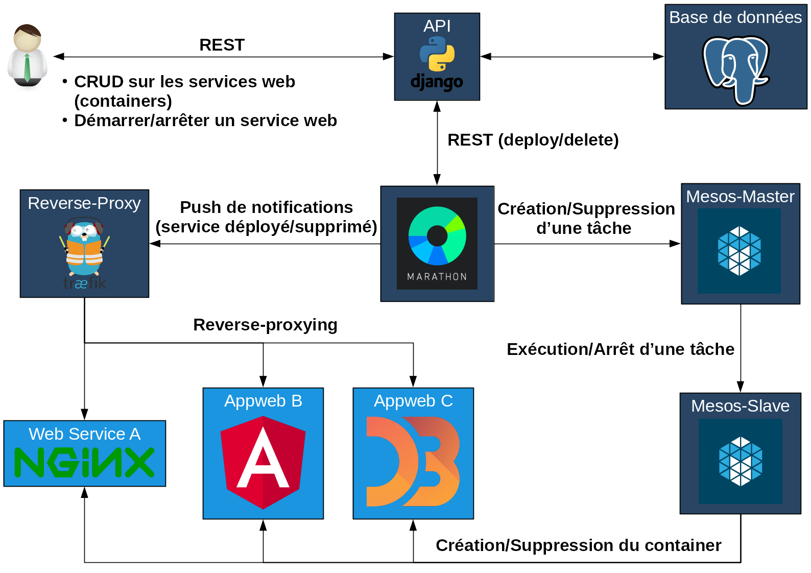

## Sommaire

* Introduction
* Objectifs
* Conception
* Méthodologie
* Problèmes rencontrés
* Démonstration
<!-- * Analyse critique -->
* Résultats obtenus
* Questions

---

## Contexte

---

## [Human Brain Project (HBP)](https://www.humanbrainproject.eu/en/)

* Projet européen ayant pour but de mieux comprendre le fonctionnement du
  cerveau humain.
* Le HBP est décomposé en 12 sous-projets.
* Le CHUV s'occupe du sous-projet 8 (SP8).
    * Mettre en place une [plateforme](https://www.humanbrainproject.eu/en/medicine/medical-informatics-platform/)
      proposant des outils pour les chercheurs.

---

## Système distribué

{ width=700px }

<aside class="notes">
  - Cluster de trois machines (physiques ou virtuelles).
  - La distribution peut-être différente sur chaque machine mais ce n'est pas
    conseillé.
  - Le DOS est mis en place grâce à des outils installés
    sur chacune des machines.
  - Le DOS évite à l'admin de gérer les ressources et
    les détails du déploiement des applications lui-même.
  - System services: sécurité, reverse-proxying, etc.
</aside>

---

## Outils

* [Mesos](http://mesos.apache.org/): gestion du cluster et de ses ressources (RAM, CPU).
* [ZooKeeper](https://zookeeper.apache.org/): coordination entre les nœuds du cluster.
* [Marathon](https://mesosphere.github.io/marathon/): orchestrateur de conteneurs
  embarquant des services.
* [Docker](https://www.docker.com/): _containerizer_.
* [Ansible](http://docs.ansible.com/): outils de déploiement automatisé.

---

## Objectifs primaires

Mettre en place une API servant de registre d'applications de visualisation
comportant:

* Une base de données [PostgreSQL](https://www.postgresql.org/).
* Différentes routes permettant l'exécution d'opérations CRUD
  sur les applications et leurs configurations.

---

## Objectifs secondaires

* Mettre en œuvre une solution permettant d'exposer
  les applications déployées. (reverse-proxying)
* Réaliser une interface graphique (frontend)
    * utilisant l'API.
    * permettant d'accéder aux applications déployées.

---

## Conception

---

## Frameworks utilisables pour le backend

* Python: [Flask](http://flask.pocoo.org/),
  [Django](https://www.djangoproject.com/)
  <i class="material-icons success">done</i>
* Java: [Spring](https://spring.io/)
* Scala: [Play 2](https://playframework.com/)
* ~~PHP: [Laravel](https://laravel.com/)~~

---

## Django

* Framework web MVT (Model - View - Template)
* Comporte de nombreux modules dont
  [Django REST framework](http://www.django-rest-framework.org/)
* Grande flexibilité

<aside class="notes">
  - Modules pour communiquer avec Marathon
  - Flexibilité
</aside>

---

## Solutions de reverse-proxying

* [Træfik](https://traefik.io/) <i class="material-icons success">done</i>
* [Vamp](http://vamp.io/)

<aside class="notes">
  - Træfik: exposition des applications uniquement.
  - Vamp: solution plus complète; load-balancing conditionnel,
    autoscaling, canary testing, etc.
</aside>

---

## Architecture générale

{ width=700px }

<!-- { width=700px } -->

---

## Base de données

{ width=700px }

---

## Méthodologie

En procédant par itération:

1. Prise en main des différentes technologies/composants de l'infrastructure
  (Mesos, Marathon, Chronos, Docker).
2. Mise en place d'un cluster.
3. Développemment de l'API et sa base de données.
4. Intégration de Træfik dans l'infrastructure mise en place.

<aside class="notes">
  - API: plus encore sa conteneurisation.
  - Beaucoup de tests de docker-compose avant d'y arriver.
</aside>

---

## Problèmes rencontrés

* Communication développeur - mandant:
* Infrastructure du SP8 difficilement utilisable en externe

<aside class="notes">
  - Le mandant avait peu de temps à disposition.
  - Le cahier des charges a tardé à être définis.
  - Changement de spécification en cours de projet.
  - Cahier des charges: environ 12 semaines
    --> tentative de prise en main des technologies en attendant
  - Changement de spécification --> discussions
  - Le développeur a dû en mettre une en place lui-même.
</aside>

---

## Démonstration

<video width="720" height="480" controls>
  <source src="videos/public_presentation.mp4" type="video/mp4">
  Your browser does not support the video tag.
</video> 

<!-- ## Analyse critique

* Développer une application monolithique dans un premier temps.
* Meilleure gestion du temps (base de données notamment).

<aside class="notes">
  - Trop de temps passé sur le problème de Boutiques.
</aside>

-->

---

## Résultats obtenus

* API:
    * CRUD sur les applications et leurs configurations fonctionnel.
    * Déploiement/suppression des applications sur Marathon possible.
* Reverse-proxying:
    * Træfik mis en place.
    * Les applications sont exposées quand elles sont déployées.

---

## Améliorations possibles

* Ajouter une interface graphique pour faciliter l'utilisation.
* Améliorer le conteneur Docker embarquant l'API.

---

## Questions?

---

## Infrastructure détaillée

{ width=700px }

---

## Fonctionnement de Træfik

{ width=700px }

---

## Schéma entité - relation

{ width=700px }
